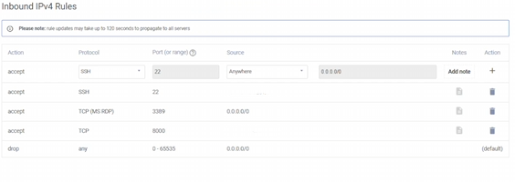
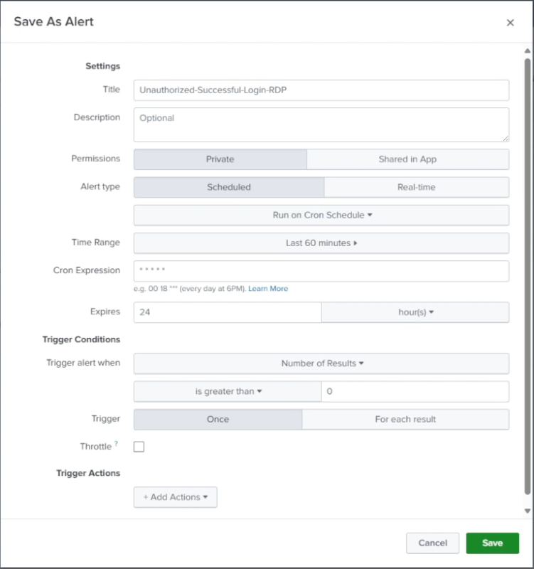
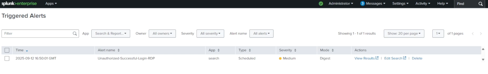

# 🚨 Splunk Alert — Successful RDP Authentication (EventCode 4624, Logon_Type 10)

I built a **scheduled Splunk alert** to detect **successful RDP logons**. I generated test telemetry by briefly loosening my **Vultr firewall** to allow RDP from anywhere, then RDP’d in via a **VPN** (different IP), and confirmed the alert **triggers**.

> 🔐 Screenshot note: blur usernames, public IPs, VPN IPs, and hostnames. Replace with placeholders (`203.0.113.25`, `10.0.0.x`).

---

## 📌 Project Overview
- **Platform:** Splunk Enterprise (Search & Reporting)
- **Data:** Windows Security events via Universal Forwarder (index `mydfir-ad`)
- **Goal:** Alert on **EventCode=4624** with **Logon_Type=10** (RDP); optional **7** (unlock) per my test
- **Test method:** Temporarily open **TCP 3389** (RDP) on Vultr firewall, then RDP from a **different IP (VPN)**

---

## ✅ Prerequisites
- Ingest of **WinEventLog:Security** into Splunk (e.g., index `mydfir-ad`)
- DC or target Windows host sending Security logs (forwarder configured)
- Access to **Vultr firewall** and **VPN** client for testing

---

## 🛠️ Steps (What I Actually Did)

### 1) Build the search in Splunk
Open **Search & Reporting** and run:

```bash
index="mydfir-ad" sourcetype="WinEventLog:Security" EventCode=4624
( Logon_Type=10 OR Logon_Type=7 )
Source_Network_Address!="-" Source_Network_Address!=40.*
| stats count by _time, ComputerName, Source_Network_Address, user, Logon_Type

```
Notes:

Logon_Type=10 = RemoteInteractive (RDP).

Logon_Type=7 = Unlock (included per my test).

📸 Screenshots:


### 2) Temporarily loosen RDP to generate telemetry
Vultr → Firewall Group (for the target VM):

Remove restrictive RDP rule.

Add: MS RDP, port 3389/tcp, Source: Anywhere (temporary for test).

Then RDP into the VM using a VPN.

📸 Screenshots:



⚠️ After testing, re-lock 3389 to your IP or disable exposure entirely.

### 3) Save search as an Alert
With the SPL still in the search bar:

Save As → Alert

Title: unauthorized-successful-logon-rdp

Permissions: Private

Alert Type: Scheduled

Time range: Past 60 minutes

Cron schedule:

I used * * * * * * (every second). Depending on Splunk version, you may need 5-field cron for every minute: * * * * *.

Expiration (ttl): 24 hours

Trigger actions: Add to Triggered Alerts

Severity: Medium

📸 Screenshots:



### 4) Verify Triggered Alerts
Open Activity → Triggered Alerts and confirm alert firings while you RDP’d in from the VPN IP.

📸 Screenshot:



🔒 Post-Test Hardening (What I Set Back)
Vultr firewall: revert 3389/tcp from “Anywhere” back to My IP only (or disable if not needed).

Host firewall (Windows): ensure RDP matches your policy baseline.

Consider alert scope: if you only care about external sources, keep exclusions like:

Source_Network_Address!=10.* Source_Network_Address!=192.168.* (optional)

🏁 Results

Built a scheduled Splunk alert for successful RDP logons (4624/10)

Generated test telemetry by RDP’ing from a VPN IP after temporarily opening 3389

Confirmed Triggered Alerts received as expected

Restored firewall to a restricted state
